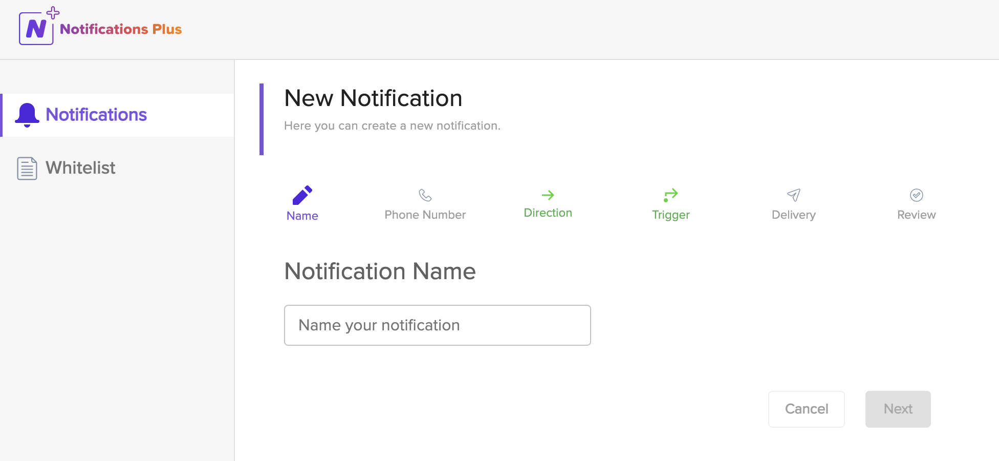

## Creating  Notifications

To create a new notification, click the **+ Notification** [button](datatable-actions.md).

The creation wizard is broken down into several steps to help guide you through the creation and editing process. Use the **Next** and **Back** buttons to navigate through the steps.

## Name
A friendly name for the notification. Choose something that will help you distinguish it from other notifications.

## Phone number
The E.164 formatted phone number that will be used to trigger this notification. *The call direction (inbound or outbound) is defined in the next step.*

The phone number field has a dropdown menu to select country codes from but you may also type the country code and number and hit tab or click outside the field for the next button to become active.

The (+) plus symbol is required when entering the country code. It can be typed in or alternatively click outside the field or hit tab for the (+) plus symbol to be prepended automatically.

## Direction
The call direction to the specified phone number that will trigger this notification, either **inbound**, **outbound** or **both**.  Inbound refers to an incoming call made *to* the specified phone number and outbound refers to an outgoing call made *from* the specified phone number.

## Trigger
Defines which call objects should trigger this notification, for example what users, extensions or sites will trigger this notification. Users is selected by default. Toggle the trigger switches to enable the different trigger options. Any combination of the available triggers can be used:

#### Users
Users is the most common trigger condition and is selected by default.  If the specified user(s) make inbound or outbound calls to the phone number, the notification will be triggered. Select a single or multiple users from the dropdown menu to build a list of users.

The **All Users** option includes all users present in your [RingCentral®](https://ringcentral.com) account, including yourself.

#### Extension Pattern
Specify a pattern to match one or many extensions that can trigger this notification. The extension pattern parameters that can be used are defined below:

*  **Wild Card** - Use an asterisk (\*\) as wild card for any number, for example 6***. In this example, any extension starting with six (6) will be recognized by the pattern.
* **Range** - Use a dash (-) between two numbers to select a range of extensions, for example 6000-9000. This will recognize all extensions between 6000 and 9000, a total of 3000 extensions.
* **Single Extension Number** - Enter a single extension number, for example 6789.
*  **Commas for multiple patterns** - Use a comma (,) to separate multiple extension patterns to aid in the creation of complex patterns. For example "5***, 6000-9000, 9101" would include all 4-digit extensions that start with 5, any extension between 6000-9000 and the single extension of 9101.

*Tip:* Click into the extension pattern form field to see a guide of example extension patterns.

#### Site Extensions
Extensions belonging to the selected site(s) will trigger the notification. A single site or multiple sites can be defined.

## Delivery
The delivery section defines the media to be used to receive the notification(s) after they have been triggered. Combinations of multiple delivery methods are also supported:

* **Email** - Sends the notification message via email. Specify multiple email addresses using a comma (,) to separate each email address.
* **Webhook** - Posts the notification message to an external webhook URL. Please enter the full URL including the 'https://' or 'http://'.
* **Glip®** - Sends the notification message to one or more [Glip®](https://app.ringcentral.com) teams. Select a team by typing or via the dropdown menu. If the desired team does not yet exist, create it on-the-fly by clicking **New Team** (see below):
     *  After clicking **New Team**, first add the team name then add users to the team by typing and selecting via the dropdown menu. Switch the team to private or keep it public depending on your requirements. Click **Create Team** to create the new team and use it as a delivery method.  
* **SMS** - Sends the notification message via SMS. Add one or more phone numbers including the country code that will receive the notification via SMS text message. *Usage and [international SMS rates](https://support.ringcentral.com/article/International-SMS.html) may apply.*

## Review
Review the selected settings for a new notification before finalization. Ensure all settings meet your requirements and click the **Save** button to save the notification.

*Tip:* Use the **Simulate** [button](datatable-actions.md) to test if the notification is working as intended without needing to trigger it.

